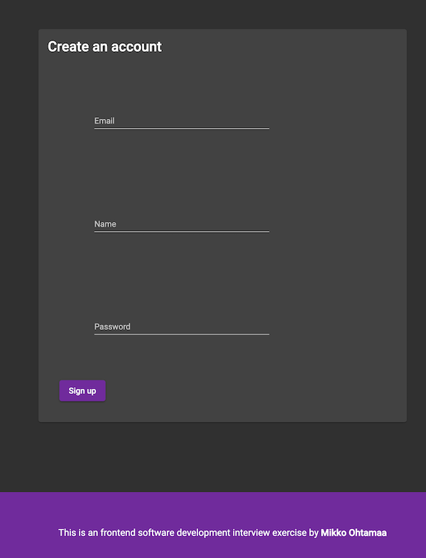

# Introduction

This is a software development exercise for a FirstBlood Technologies frontend developer position.

If you have not applied yet, apply through [StackOverlow page](https://stackoverflow.com/jobs/companies/firstblood).

This exercise is open only for candidates who were invited from the exercise beforehand.
If you did not get invited please do not take this exercise.

# Exercise

## Your task

Your task is to create a registration form for Angular and Angular Material application.
We estimate this will take 3-4 hours for a person who is familiar with the technology stack.

Task:

- You are building an imaginary video gaming application

- Update the registration screen to an existing Angular application skeleton
  - We need to input the following from the new users:
    - Email
    - Password
    - Display name
    - Phone number in an international plus prefixed format, like `+1 555 1231234`

- Make the the registration screen look professional. Now it is intentionally made to look ugly.

- Think phone number input UX.
  A phone number widget must have a good UX for global visitors who might lack an understanding
  what phone number country code is. Feel free to use your favorite phone number
  widget.

- Add a phone number to the existing dashboard screen, so that users can see the phone number
  associated with their account

- Add end-to-end tests for the new registration functionality
  - Registration success - validated by having the information visible on the dashboard screen
  - Bad phone number
  - Bad email
  - Password mismatch
  - Any other validation you know needs to be done on a normal registration form
  - If you do not like Protractor you are free to use Cypress or other alternatives

- Open a pull request which will be reviewed
  - Commentary contains screenshots of changed screens
  - Commentary contains instructions for an internal QA team (the exercise author, or me) how to manually test your pull request
    assuming they run the application locally on their computer
  - Commentary on other application structure you would prefer to change if you were to take over the whole application,
    or other useful suggestions

- As the application is unfinished, we are focusing only on the UX of the registration screen,
  not on issues like project file layout


This is your starting point:



## How to submit the exercise

- [ ] Create a private copy of this Github repository
- [ ] Complete the task above
- [ ] Create a new pull request against **your private repository**
- [ ] In the PR, write down number of hours you spent on this exercise (we do not use this to rank you, we use it to adjust the duration of future exercises)
- [ ] Invite a Github user `miohtama` to your repository
- [ ] Send email to `mikko@fb.io` that you have completed the exercise

## How your exercise submission will be ranked

We will look

1. Whether the task was correctly completed and every instruction was followed
2. Visual quality of the user interface changes - the layouts must look professional, extra points for eye candy and something that looks video gamey
3. Tests pass: both new and old
4. Pull request description quality - the pull request must look like a professional
5. Code comment quality - if your code lacks helpful comments you will be negatively scored for it

# How to run code

## Development server

Run `ng serve` for a dev server. Navigate to `http://localhost:4200/`. The app will automatically reload if you change any of the source files.

Tested on Node v12.

Example:

```sh
npm install
ng serve
```

Should give you

```
10% building 3/3 modules 0 activeℹ ｢wds｣: Project is running at http://localhost:4200/webpack-dev-server/
ℹ ｢wds｣: webpack output is served from /
ℹ ｢wds｣: 404s will fallback to //index.html

chunk {main} main.js, main.js.map (main) 71.4 kB [initial] [rendered]
chunk {polyfills} polyfills.js, polyfills.js.map (polyfills) 264 kB [initial] [rendered]
chunk {runtime} runtime.js, runtime.js.map (runtime) 6.15 kB [entry] [rendered]
chunk {styles} styles.js, styles.js.map (styles) 179 kB [initial] [rendered]
chunk {vendor} vendor.js, vendor.js.map (vendor) 6.98 MB [initial] [rendered]
Date: 2020-02-04T10:04:44.023Z - Hash: 6e5aa8eb8c49ec6ad889 - Time: 10113ms
** Angular Live Development Server is listening on localhost:4200, open your browser on http://localhost:4200/ **
ℹ ｢wdm｣: Compiled successfully.
```

## Code scaffolding

Run `ng generate component component-name` to generate a new component. You can also use `ng generate directive|pipe|service|class|guard|interface|enum|module`.

## Build

Run `ng build` to build the project. The build artifacts will be stored in the `dist/` directory. Use the `--prod` flag for a production build.

## Running unit tests

Run `ng test` to execute the unit tests via [Karma](https://karma-runner.github.io).

## Running end-to-end tests

Run `ng e2e` to execute the end-to-end tests via [Protractor](http://www.protractortest.org/).

## Running tests with Visual Studio Code

You can also run tests under [Visual Studio Code with debug/breakpoint support with these instructions](https://github.com/microsoft/vscode-recipes/tree/master/Angular-CLI#debug-end-to-end-tests).

* Start `ng serve` on a background

* Setup `ng e2e` configuration within a Visual Studio Code debug launcher. `launch.json` example:

```json
{
    "version": "0.2.0",
    "configurations": [
        {
            "type": "node",
            "request": "launch",
            "name": "Launch Program",
            "skipFiles": [
                "<node_internals>/**"
            ],
            "program": "${workspaceFolder}/serve",
            "preLaunchTask": "tsc: build - tsconfig.json",
            "outFiles": [
                "${workspaceFolder}/dist/out-tsc/**/*.js"
            ]
        },

        {
            "name": "ng e2e",
            "type": "node",
            "request": "launch",
            "program": "${workspaceFolder}/node_modules/protractor/bin/protractor",
            "protocol": "inspector",
            "args": ["${workspaceFolder}/e2e/protractor.conf.js"]
          }
    ]
}
```

* Add a breakpoint by using the red dot in a gutter in Visual Studio Code editor

* Launch `ng e2e` by pressing the debug run button in Visual Studio Code

* Now any hit breakpoint should pop up the debugger within Visual Studio Code

## Further help

To get more help contact me via email or [poke me on LinkedIn](https://www.linkedin.com/in/ohtis/).